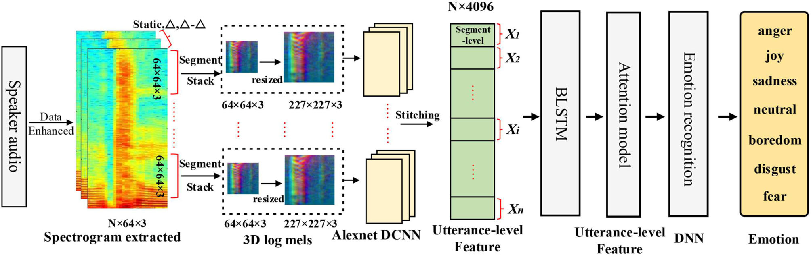

# Tensorflow Implementation for "Pre-trained Deep Convolution Neural Network Model With Attention for Speech Emotion Recognition"

<h1 align="center">
  <br>
Pre-trained Deep Convolution Neural Network Model With Attention for Speech Emotion Recognition
  <br>
</h1>

> **Pre-trained Deep Convolution Neural Network Model With Attention for Speech Emotion Recognition**<br>
> Hua Zhang, Ruoyun Gou, Jili Shang, Fangyao Shen, Yifan Wu and Guojun Dai<br>
>
> **Abstract:** *Speech emotion recognition (SER) is a difficult and challenging task because of the affective variances between different speakers. The performances of SER are extremely reliant on the extracted features from speech signals. To establish an effective features extracting and classification model is still a challenging task. In this paper, we propose a new method for SER based on Deep Convolution Neural Network (DCNN) and Bidirectional Long Short-Term Memory with Attention (BLSTMwA) model (DCNN-BLSTMwA). We first preprocess the speech samples by data enhancement and datasets balancing. Secondly, we extract three-channel of log Mel-spectrograms (static, delta, and delta-delta) as DCNN input. Then the DCNN model pre-trained on ImageNet dataset is applied to generate the segment-level features. We stack these features of a sentence into utterance-level features. Next, we adopt BLSTM to learn the high-level emotional features for temporal summarization, followed by an attention layer which can focus on emotionally relevant features. Finally, the learned high-level emotional features are fed into the Deep Neural Network (DNN) to predict the final emotion. Experiments on EMO-DB and IEMOCAP database obtain the unweighted average recall (UAR) of 87.86 and 68.50%, respectively, which are better than most popular SER methods and demonstrate the effectiveness of our propose method.*

<h4 align="center"><a href="https://doi.org/10.3389/fphys.2021.643202">link to paper</a></h4>

# Requirements
The project has been tested on a python=3.7 on Ubuntu 20.04 with the following packages:
```
tensorflow=2.7.0
librosa=0.8.1
scikit-learn=1.0.1
```

Uses librosa to read files, which needs `sndfile`.  
Use `sudo apt-get install libsndfile1` to install sndfile library
# Usage  
This repository can be used in the following ways:  
1. Using `train.py`.  
  i. Download the RAVDESS dataset (only this dataset is supported as of now) and extract it within the dataset directory. Then run the commands below to move all files into the `.dataset/` directory from indivisual sub folders like `.dataset/Actor-xx`. Run these from within the `dataset` directory. Make sure to be in the `.dataset/` directory before running these comannds from a linux terminal.
    ```
    find . -mindepth 2 -type f -print -exec mv {} . \;  
    rm -r Actor_*
    Then 
    ```
    ii. Run `train.py` with required options. Use `python train.py -h` to check all options available. A saved_model will be put in the `saved_model` directory.  
    iii. Use `infer.py` to run inference on a set of files.
2. Using `SpeechModel.py` to get a Keras Model into your code. This model follows specifications mentioned in the paper. You may write your own dataset code.   
    Example:  
    ```
    # Your own dataset architecture
    from SpeechModel import SpeechModel
    SP = SpeechModel
    model = SP.create_model()
    # Rest of model training code
    ```
3. Using just the `load_wav` and `get_framed_log_melspectrogram` functions from `utils.py`, you can write your own dataset funcion, as well as your own model. This function returns a `(num_frames, 64, 64, 3)` shaped array that can be fed to a [TimeDistributed](https://www.tensorflow.org/api_docs/python/tf/keras/layers/TimeDistributed) network of your choice.  

# Model Description
The model uses a [TimeDistributed](https://www.tensorflow.org/api_docs/python/tf/keras/layers/TimeDistributed) layer to feed all segments of a audio file that have been converted into 3 channel images to a pretrained CNN network (in this case, resnet50_v2, trained on imagenet). Following this, we have bi-lstm layers and attention layers. Then, there are Fully Connected Layers with dropout and finally, classification with 8 nodes.  
<center><br>
(Image credits: Paper cited below)</center>


# Example usage
## Training
- Use `python train.py -h` to see a list of arguments.  
- `python train.py 30` to train the model for 30 epochs  

## Inference
(Still to be implemented)  

# Limitations
1. Currently this repo only supports dataset preparation for the RAVDESS model since different datasets describe their labels differently. You can still use this repo with other datasets by defining your own function to load the datasets and using the `get_framed_log_melspectrograms` function from `utils.py`.  
Then you may use `SpeechModel.py` to create a model based on specifications form the paper and train.  
2. Since I couldn't find a pretrained AlexNet model and didn't have the resources myself to train one from scratch, I used a pretrained ResNet 50 model. This may affect the performance and not match the results given by the authors.  


# Credits and acknowledgements:
I did this work for a hackathon. This method did not produce the best results for my use case. I suspect this was due to the dataset being very noisy.

# Citation
>
    AUTHOR=Zhang Hua, Gou Ruoyun, Shang Jili, Shen Fangyao, Wu Yifan, Dai Guojun
        
    TITLE=Pre-trained Deep Convolution Neural Network Model With Attention for Speech Emotion Recognition  
        
    JOURNAL=Frontiers in Physiology     
        
    VOLUME=12      
        
    YEAR=2021
        
    PAGES=177   
            
    URL=https://www.frontiersin.org/article/10.3389/fphys.2021.643202     
        
    DOI=10.3389/fphys.2021.643202    
        
    ISSN=1664-042X   

    ABSTRACT=Speech emotion recognition (SER) is a difficult and challenging task because of the affective variances between different speakers. The performances of SER are extremely reliant on the extracted features from speech signals. To establish an effective features extracting and classification model is still a challenging task. In this paper, we propose a new method for SER based on Deep Convolution Neural Network (DCNN) and Bidirectional Long Short-Term Memory with Attention (BLSTMwA) model (DCNN-BLSTMwA). We first preprocess the speech samples by data enhancement and datasets balancing. Secondly, we extract three-channel of log Mel-spectrograms (static, delta, and delta-delta) as DCNN input. Then the DCNN model pre-trained on ImageNet dataset is applied to generate the segment-level features. We stack these features of a sentence into utterance-level features. Next, we adopt BLSTM to learn the high-level emotional features for temporal summarization, followed by an attention layer which can focus on emotionally relevant features. Finally, the learned high-level emotional features are fed into the Deep Neural Network (DNN) to predict the final emotion. Experiments on EMO-DB and IEMOCAP database obtain the unweighted average recall (UAR) of 87.86 and 68.50%, respectively, which are better than most popular SER methods and demonstrate the effectiveness of our propose method.
